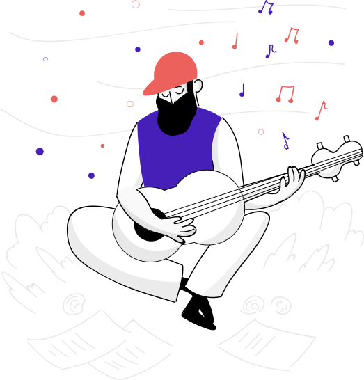
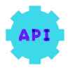

<br>
<h2 align="center">Hi There</h2>


<p align="center">My name is Ali Tahir and welcome to my portfolio</p>
<div display:flex, align="center">
<a href="mailto:alitahir2013@gmail.com" target="_blank"></a>
<a href="https://www.linkedin.com/in/ali-tahir-948454248/" target="_blank"></a>
<a href="https://www.instagram.com/alitahir_10/" target="_blank"></a>
</div>

<br>
<br>

```powershell
-> ~/portfolio flutter:(stable) > flutter run
```
<br>
<br>



<div width="30%">
    
```csharp
    Human Information
    ------------------------------------------
    Name: Ali Tahir
    Age: 23
    Role: Flutter Developer
    Mindset: "Forever learning. Forever building."
    Hobbies: ["Football"], ["Coding"], ["Gaming"], ["Music"]
    Languages: ["Urdu"], ["English"]
```

</div>

<br>
<br>
<br>

<div align="center">
 <table align="left" width = "70%" height="230px">
        <tr>
            <td align="center" width="140" height="112.43">
                
                <br /> Flutter
            </td>
            <td align="center" width="140" height="112.43">
                
                <br /> Dart
            </td>
            <td align="center" width="140" height="112.43">
                
                <br /> Python
            </td>
        </tr>
        <tr>
            <td align="center" width="140" height="112.43">
                
                <br /> Firebase
            </td>
            <td align="center" width="140" height="112.43">
                
                <br /> Django
            </td>
             <td align="center" width="140" height="112.43">
                
                <br /> RESTful
            </td>
        </tr>
    </table>

</div>
<br>
<br>
<br>
<div>


<div width ="70%">
    
```csharp
    Developer Skills
    ------------------------------------------
    Language: ["Dart"], ["Python"], ["C++"], ["Java"] (basic)
    Frameworks: ["Flutter"], ["Provider"], ["BLoC"], ["Firebase"], ["Django"] (basic)
    Version Control: ["Git"], ["GitHub"]
    Backend: ["Firebase"], ["RESTFUL APIs"], ["SQLite"] (basic)
    Other Skills: ["MVVM"], ["Debugging & Testing"]
```
</div>
</div>


<br>
<br>
<br>


<div>


<div width ="70%">
    
```csharp
Education
------------------------------------------
• Bachelor's in Computer Science (Pursuing)
    University of Engineering and Technology Taxila, 2021 November - 2025 June.

Experience
------------------------------------------
• Eziline Software House | Internship | 2024 March - 2024 May (3 Months)
• Freelance Flutter Developer | 2023 August - 2025 April
```
    
</div>
</div>


<br>
<br>

```powershell
> run portfolio --show-projects
```


<a href="https://github.com/itsAliTahir/gemini-clone"></a>
<a href="https://github.com/itsAliTahir/e-commerce-app-with-stripe-payment"></a>
<a href="https://github.com/itsAliTahir/Premier_League_Database_Flutter_Project"></a>
<a href="https://github.com/itsAliTahir/SIMULATION-PAGE-REPLACEMENT-POLICIES-COMPARISON-Operating-System-Project-"></a>
<a href="https://github.com/itsAliTahir/news_app"></a>
<a href="https://github.com/itsAliTahir/Expense-Tracker"></a>


<br>

<hr>

<table>
  <tr>
    <td colspan="2">
     
    </td>
  </tr>
  <tr>
    <td>
      
    </td>
    <td>
      
    </td>
  </tr>
</table>


<!-- 
<h2 align="center">Connect with me 🌐</h2>
<hr>

<p align="center">
    <a href="mailto:alitahir2013@gmail.com" target="_blank">
        
    </a> 
    <a href="https://www.linkedin.com/in/ali-tahir-948454248/" target="_blank">
        
    </a> 
    <a href="https://web.facebook.com/profile.php?id=100051901068678" target="_blank">
        
    </a>
</p>

-->
